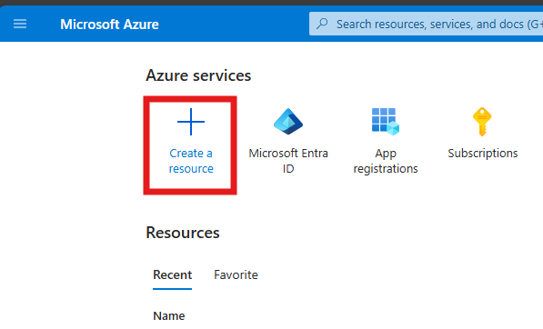
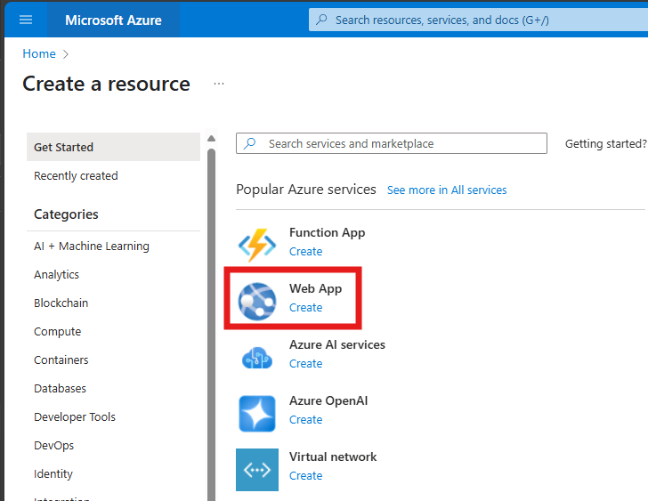
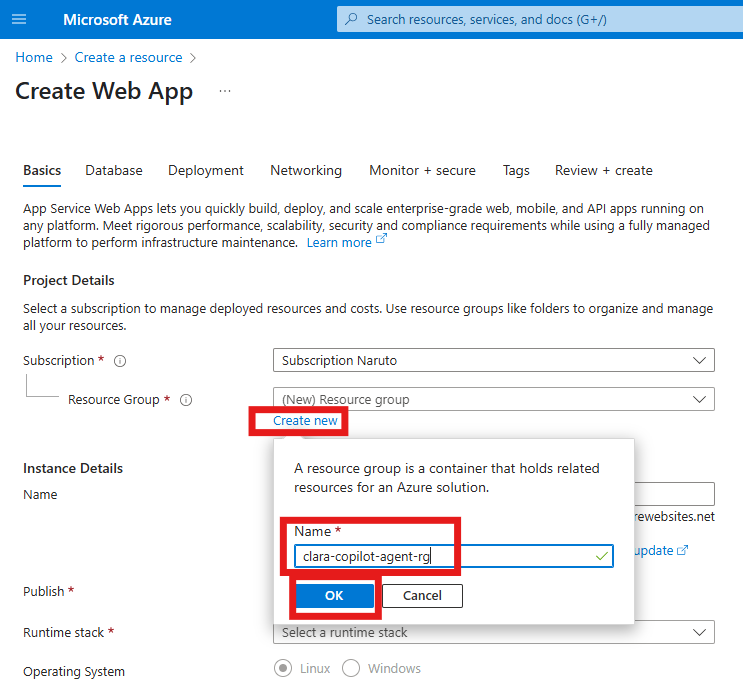
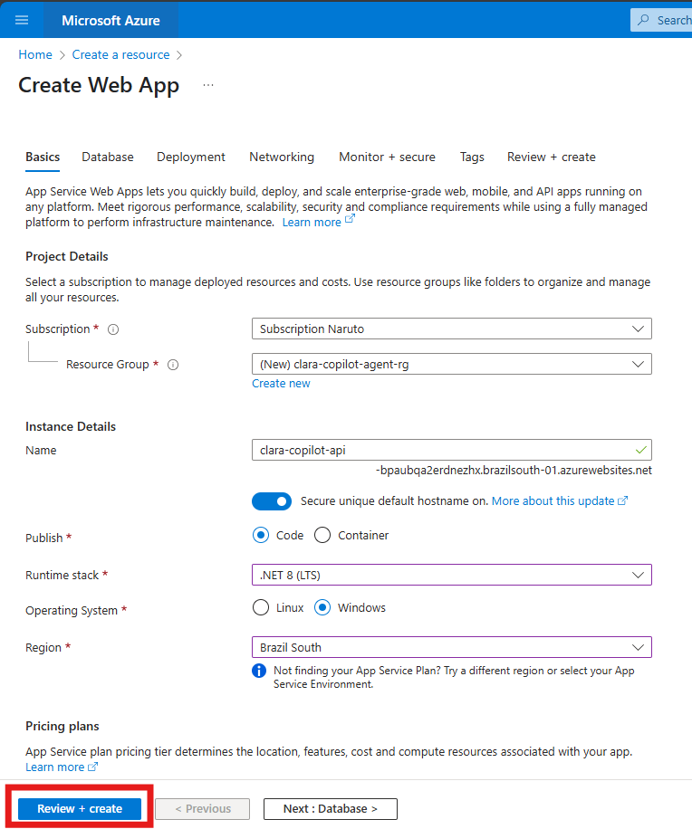
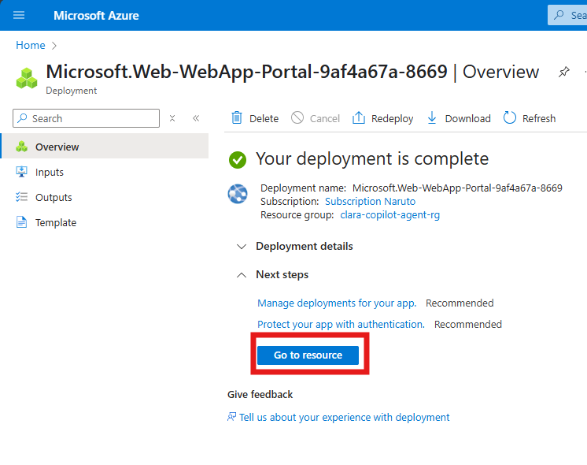

# 👧 CLARA -Copilot License Assignment & Report Agent

**Clara** is an intelligent AI agent built on Microsoft Copilot Studio that revolutionizes M365 Copilot license management for enterprises. It automates license monitoring, optimizes allocation, and streamlines user communication to ensure maximum ROI on your M365 Copilot investment.

| [Documentation](https://github.com/luishdemetrio/clara-copilot-agent) |  [Azure Application Registration guide ](https://github.com/luishdemetrio/clara-copilot-agent/blob/main/docs/azure_deployment.md)  | [Local Deployment guide (opcional)](https://github.com/luishdemetrio/clara-copilot-agent/blob/main/docs/local_deployment.md) |[SharePoint M365 Copilot Wait List](https://github.com/luishdemetrio/clara-copilot-agent/blob/main/docs/sharepoint_deployment.md) |[Import CLARA to Copilot Studio](https://github.com/luishdemetrio/clara-copilot-agent/blob/main/docs/import_clara.md) |[Azure REST API](https://github.com/luishdemetrio/clara-copilot-agent/blob/main/docs/appservice_deployment.md)
| ---- | ---- | ---- |  ---- | ---- | ---- |  

## ☁ Deploying Clara REST API to Azure App Service

---
### 🧱 Step 1: Open Azure Portal

   1. Go to [Portal Azure](https://portal.azure.com/) and sign in with your Azure credentials.

---   
### 🧱 Step 2: Create a New Web App Service

   1. In the left menu, click on **Create a resource**.
   
      
   
   2. Search for **Web App** and click **Create**.
   
      

   3. Fill in the required fields:

      - **Subscription**: Select your Azure subscription.
    
      - **Resource Group:** Select an existing group or create a new one (e.g., **clara-copilot-agent-rg**).
      
        
      
      - **Name**: Enter a unique name for your app (e.g., clara-copilot-api).

      - Publish: Select Code.
      
      - Runtime stack: Choose .NET 8 (LTS) or the version required by Clara.
      
      - Region: Choose the region closest to your users.
      
   5. Click **Review + create**.
   
      
      
   6. Click **Create**.   
   
      
      
   7. After created, click on **Go to resource**.   
   
        
   
---   
### 🧱 Step 3: Configure Deployment Center for GitHub Integration

   1. Once the Web App is deployed, go to your new Web App resource.
   2. In the left menu, scroll down and click on Deployment Center.
   3. Under Source, select GitHub.
   4. Sign in to your GitHub account if prompted and authorize Azure.
   5. Select the following:
      - Organization: Your GitHub organization or username.
      - Repository: The repository containing the Clara REST API code.
      - Branch: The branch you want to deploy (e.g., main).
   6. Click Save or Finish to set up continuous deployment.

---   
### 🧱 Step 4: Monitor Deployment

  1. In the Deployment Center, you can view the status of your deployment.
  2. Wait for the deployment to complete. You’ll see logs and status updates.
  3. Once complete, your Clara REST API will be live at:
https://<your-app-name>.azurewebsites.net/