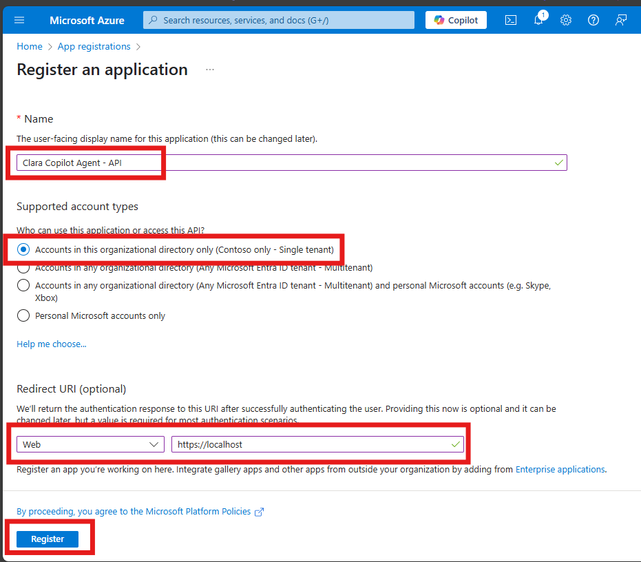
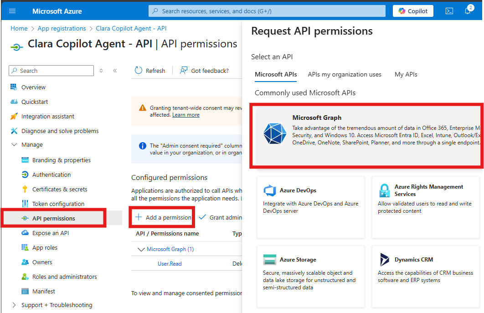
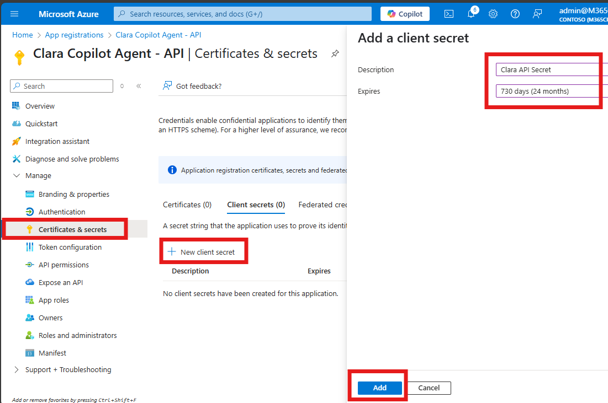
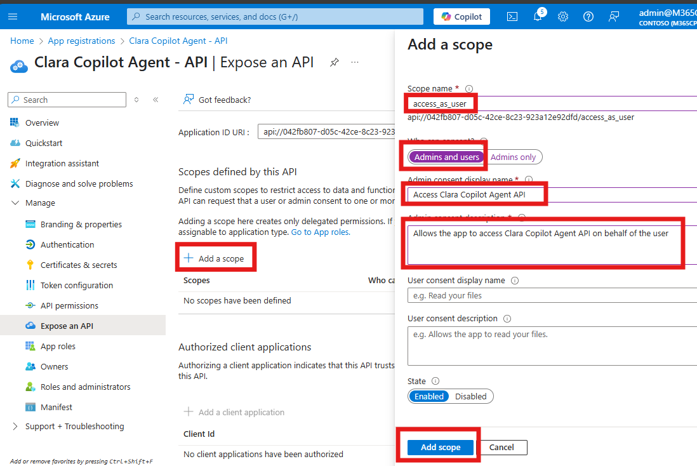

# 👧 CLARA -Copilot License Assignment & Report Agent

**Clara** is an intelligent AI agent built on Microsoft Copilot Studio that revolutionizes M365 Copilot license management for enterprises. It automates license monitoring, optimizes allocation, and streamlines user communication to ensure maximum ROI on your M365 Copilot investment.

| [Documentation](https://github.com/luishdemetrio/clara-copilot-agent) | [Local Deployment guide](https://github.com/luishdemetrio/clara-copilot-agent/readme_local.md) | [Azure Deployment guide ](https://github.com/cristianoag/microsoft-teams-apps-company-communicator/wiki/Deployment-guide-powershell)  |
| ---- | ---- | ---- | 

## 🔐 Securing Clara REST APIs with Azure App Registration

This lab will guide you through the process of registering an application in Azure Active Directory (Azure AD) to secure the REST APIs used by the Clara agent.

---

## 🧰 Prerequisites

- Azure subscription with admin access
- Access to Azure Active Directory (AAD)
- REST APIs deployed (e.g., on Azure App Service)
- Postman or similar tool for testing (optional)

---

## 🧱 Step 1: Register a New Application in Azure AD

1. Go to https://portal.azure.com
2. Navigate to **Azure Active Directory** > **App registrations**
3. Click **+ New registration**

   
   
4. Fill in the details:
   - **Name**: `Clara Copilot Agent - API`
   - **Supported account types**: Choose based on your org (e.g., "Single tenant")
   - **Redirect URI**: Leave blank or set to `Web` - `https://localhost` for now
5. Click **Register**

   

---

## 🧱 Step 2: Configure API Permissions

1. In the app registration, go to **API permissions**
2. Click **+ Add a permission**
3. Choose **Microsoft Graph** 

   

4. **Application permissions**

5. Add permissions like:
   - `Directory.Read.All`
   - `Directory.ReadWrite.All`
   - `Reports.Read.All`
   - `User.Read.All`
6. Click **Add permissions**

   
   
7. Click **Grant admin consent** (if required)

   

---

## 🧱 Step 3: Generate a Client Secret
1. Go to **Certificates & secrets**
2. Click **+ New client secret**
3. Add a description (e.g., `Clara API Secret`) and choose an expiry
4. Click **Add**

   
   
5. **Copy the secret value** immediately — you won’t see it again!

   

---

## 🧱 Step 4: Define a Custom Scope and Expose the API

To allow your REST API to be securely accessed by clients (like the Clar agent), you need to expose it as an API in Azure AD and define scopes.

1. Go to Expose an API

      - Go to **Expose an API**
      - Click **Add** for Application ID URI (e.g., api://<client-id>), keep the default value and then click on Save.

        
   
      - Click **+ Add a scope**
        - Name: `access_as_user`
        - Admin consent display name: `Access Clara Copilot Agent API`
        - Description: `Allows the app to access Clara Copilot Agent API on behalf of the user`
        - Click **Add scope** to save.

        
