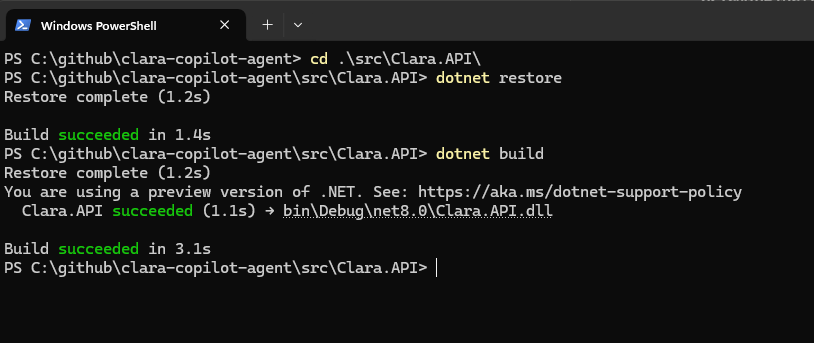
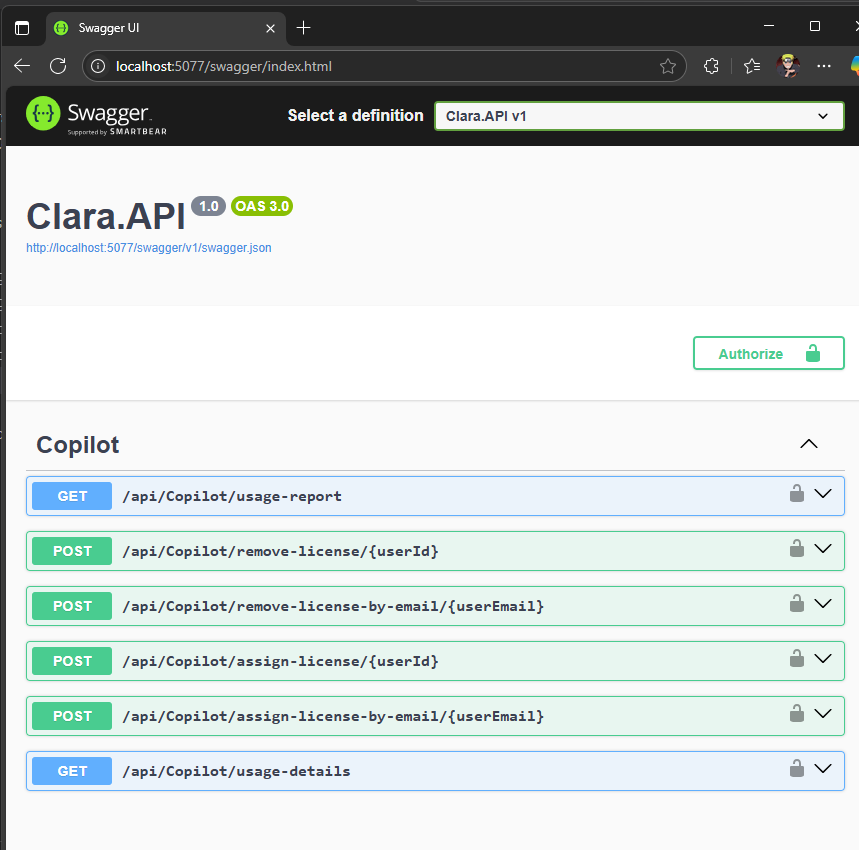

# 👧 CLARA -Copilot License Assignment & Report Agent

[](https://opensource.org/licenses/MIT)
[](https://copilotstudio.microsoft.com/)
[](https://dotnet.microsoft.com/)

**Clara** is an intelligent AI agent built on Microsoft Copilot Studio that revolutionizes M365 Copilot license management for enterprises. It automates license monitoring, optimizes allocation, and streamlines user communication to ensure maximum ROI on your M365 Copilot investment.


| [Documentation](https://github.com/luishdemetrio/clara-copilot-agent) |  [Azure Deployment guide ](https://github.com/luishdemetrio/clara-copilot-agent/blob/main/docs/azure_deployment.md)  | [Local Deployment guide](https://github.com/luishdemetrio/clara-copilot-agent/blob/main/docs/local_deployment.md) |
| ---- | ---- | ---- | 


## 🚀 Quick Start to Run it Locally

### Prerequisites

- Microsoft 365 E3/E5 licenses with Copilot
- Microsoft Copilot Studio access
- SharePoint Online
- Power Automate Premium
- Azure subscription for API hosting

---
### 🧱 Step 1: Clone the Repository


   ```PowerShell
   git clone https://github.com/luishdemetrio/clara-copilot-agent.git
   cd clara-copilot-agent
   ```

### 🧱 Step 2: Build the .NET APIs

   ```PowerShell
   cd src/Clara.API
   dotnet restore
   dotnet publish -c Release
   ```
   
   
   
  You can also open the project in Visual Studio Code or your preferred IDE. 
   
### 🧱 Step 3: Configure Azure AD Authentication in appsettings.json

To enable secure access to the Clara API using Azure Active Directory (Azure AD), update the appsettings.Development.json file in the Clara.API project with the values from your Azure App Registration.

```json
"AzureAd": {
  "Instance": "https://login.microsoftonline.com/",
  "Domain": "<your-tenant>.onmicrosoft.com",
  "TenantId": "<your-tenant-id>",
  "ClientId": "<your-app-client-id>",
  "Audience": "<your-app-client-id>"
}
```


Explanation of Each Field


<table>
<thead>
	<tr>
		<th>Field</th>
		<th>Description</th>
	</tr>
</thead>
<tbody>
	<tr>
		<td>Instance</td>
		<td>Base URL for Azure AD authentication. Always use <code style="font-family: source-code-pro, Menlo, Monaco, Consolas, &quot;Courier New&quot;, monospace;">https://login.microsoftonline.com/`</td>
	</tr>
	<tr>
		<td>Domain</td>
		<td>Your Azure AD tenant domain, e.g., <code style="font-family: source-code-pro, Menlo, Monaco, Consolas, &quot;Courier New&quot;, monospace;">contoso.onmicrosoft.com`</td>
	</tr>
	<tr>
		<td>TenantId</td>
		<td>The unique GUID of your Azure AD tenant</td>
	</tr>
	<tr>
		<td>ClientId</td>
		<td>The Application (client) ID of your registered app in Azure AD</td>
	</tr>
	<tr>
		<td>Audience</td>
		<td>Should match the Application ID URI set when exposing the API. If you accepted the default, this is the same as ClientId</td>
	</tr>
</tbody>
</table>

> ℹ
>
> Note: The steps to obtain these values are described in the [Azure Deployment guide ](https://github.com/luishdemetrio/clara-copilot-agent/blob/main/docs/azure_deployment.md).


### 🧱 Step 4: Run the Clara API Locally

Run the Clara API locally for development or testing:

1. Open the Terminal console and run:

    ```PowerShell
    dotnet run
    ```
    
    
    
    
2. By default, the API will be available at: `http://localhost:5077`


3. You can test it by opening the Swagger UI in your browser:

   `http://localhost:5077/swagger/index.html`
   
   
   
   

> ℹ
> 
> The APIs are protected. To test them, you must register a client app and use the **"Authorize"** button in Swagger to provide the client ID and secret. Follow the same steps as described in the [Azure Deployment guide ](https://github.com/luishdemetrio/clara-copilot-agent/blob/main/docs/azure_deployment.md) for registering a **client application**.

---
### 🧱 Step 5: Test Clara API Locally via Swagger

Now that you have configured Azure AD authentication and registered a client application, you can test the Clara API locally using the built-in Swagger UI.

✅ Prerequisites
- Clara API is running locally (e.g., via dotnet run)
- You have the following values from your Azure App Registration:

  - Client ID
  - Client Secret
  - Tenant ID
  - Scope (usually api://<client-id>/.default)

#### 🧪 Steps to Test

1. Open Swagger UI
   
   `Navigate to https://localhost:5077/swagger/index.html` in your browser.

2. Click the **"Authorize"** button

   This opens a dialog to input your OAuth credentials.

3. Fill in the OAuth2 fields

   - **Client ID:** Paste your Azure AD app’s client ID
   - **Client Secret:** Paste your client secret
   - **Scope:** check the listed scope

4. Click **"Authorize"**

   Swagger will request a token and apply it to all API calls.

5. Test Endpoints

   Try calling any of the secured endpoints (e.g., /api/license/usage) to verify that authentication is working.

> ℹ️
>
> If you receive a 401 Unauthorized error, double-check your client credentials, scope, and that the Clara API is running with the correct Azure AD settings in appsettings.Development.json.

---
### 🧱 Step 6: Expose the API to the Internet Using ngrok

o test the Clara API with external services like Power Platform or Copilot Studio, you can expose your local API to the internet using https://ngrok.com/.

1. Install ngrok
Download and install ngrok from https://ngrok.com/download.

2. Authenticate ngrok (first-time setup)

You can find your auth token in your ngrok dashboard after signing up.

3. Start the tunnel

This will generate a public HTTPS URL like:

https://abc123.ngrok.io
4. Update Azure App Registration
To test OAuth flows, update the redirect URI in your Azure App Registration to include the new ngrok URL.

5. Test the API
Use the ngrok URL to test the API from external tools like Postman or Power Platform custom connectors.

⚠️ Keep the ngrok tunnel running while testing. Restarting it will generate a new URL unless you have a paid plan with reserved domains.